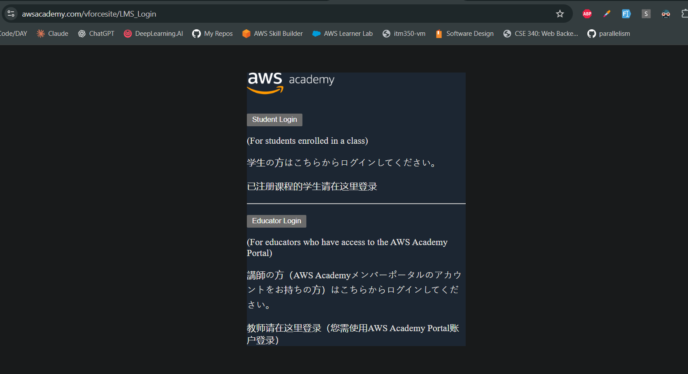
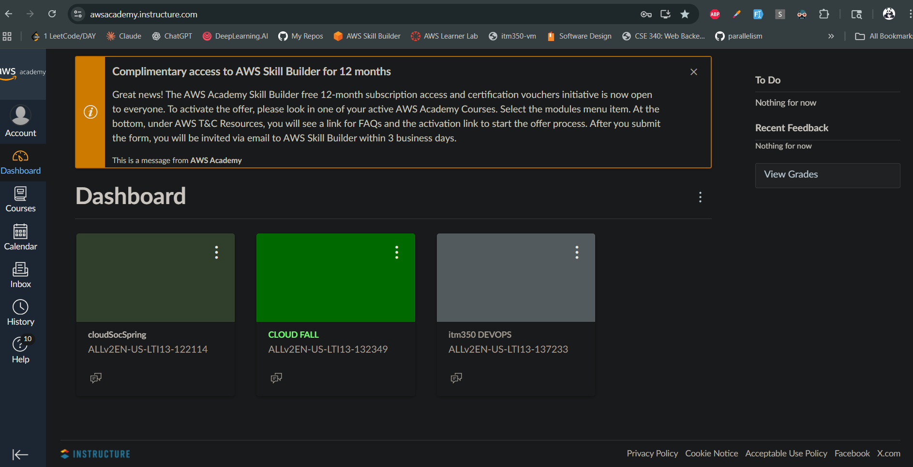
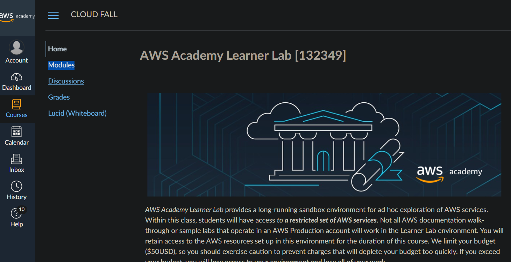
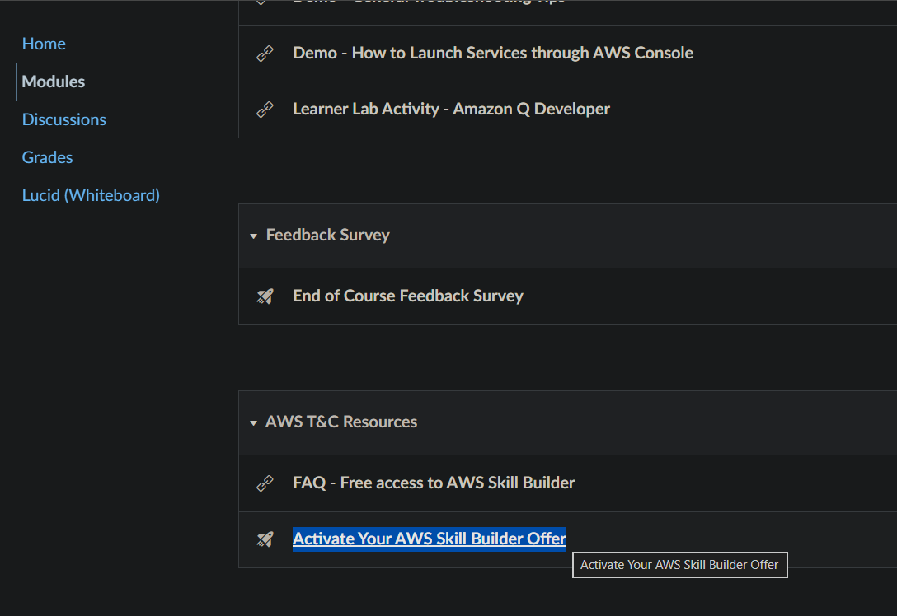
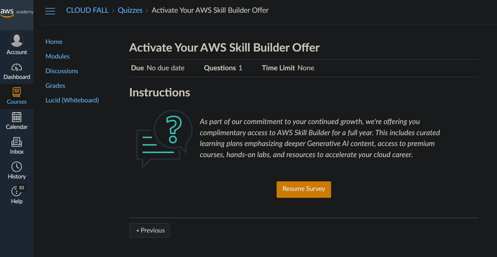
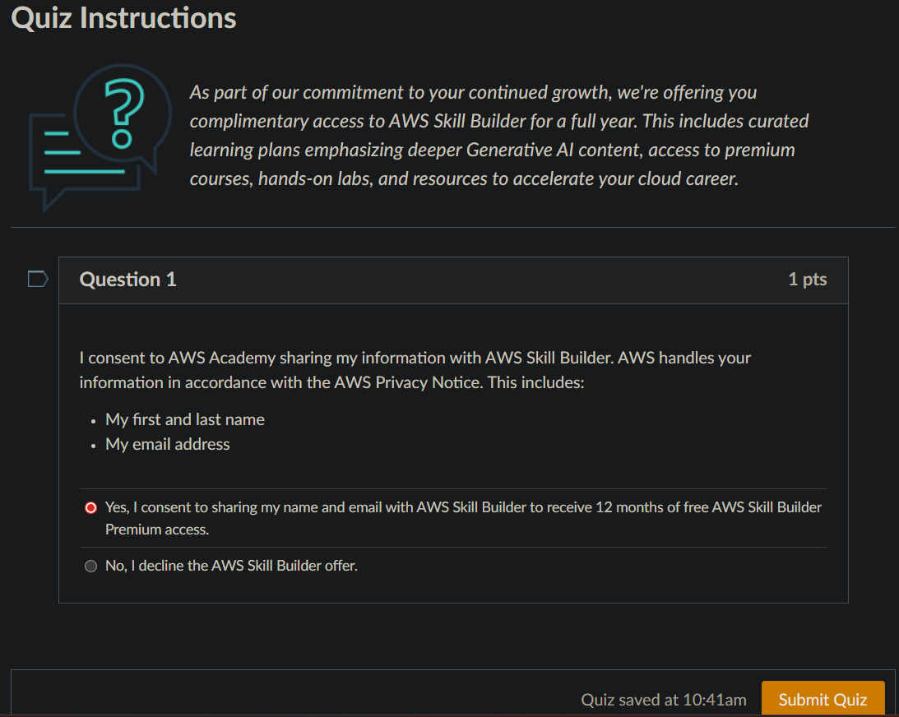
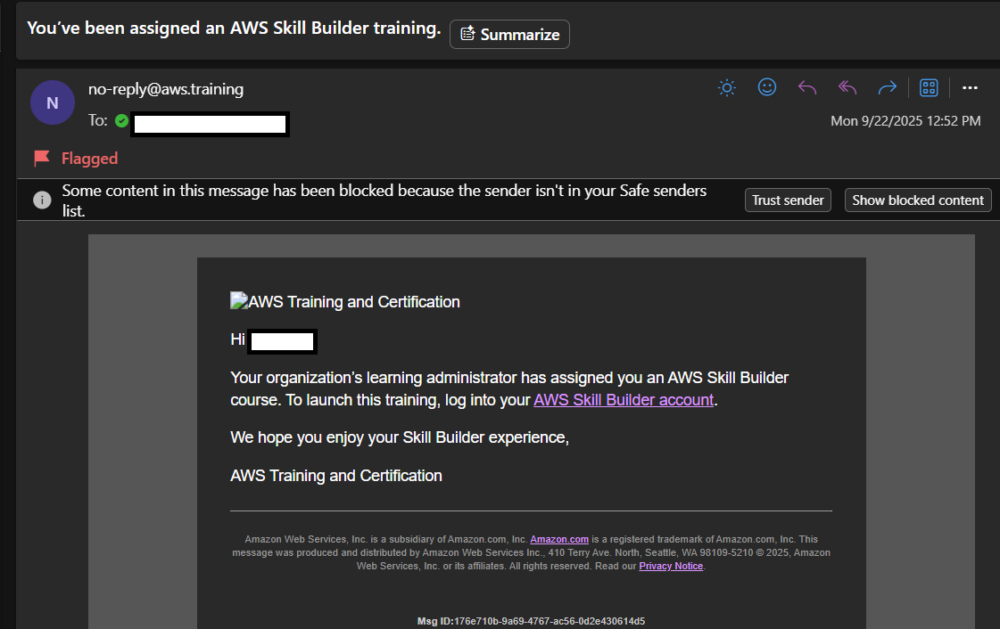
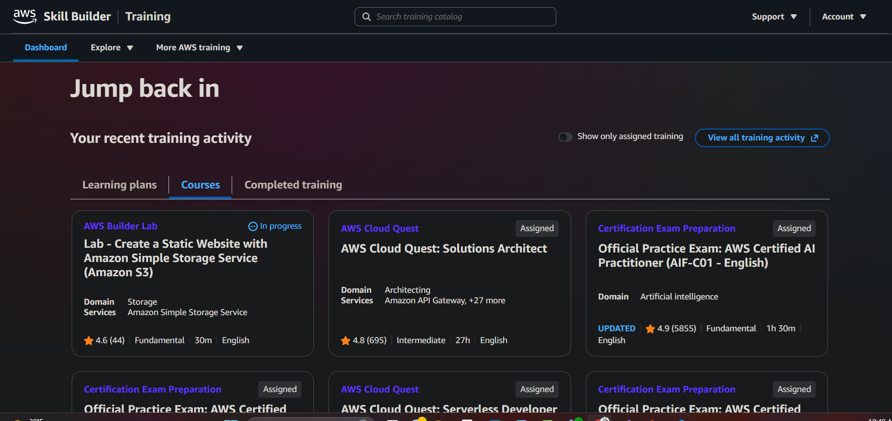

# 🎓 AWS Skill Builder — Free 1 Year Enrollment Guide

> **AWS Skill Builder** is Amazon Web Services' official learning platform, offering hands-on labs, exam prep, certification vouchers, and more. As of **11/8/2025**, you can get a **12-month free subscription**!

---

> **⚠️ Requirements:**
>
> - You **must** have an active AWS Academy Course (visible on your AWS Academy Canvas dashboard).
> - You need an **AWS Academy Learner Lab Account** (from ITM courses or Cloud Solution Society participation).

---

## 🚀 How to Activate Your Free Year

### 1. Sign In to AWS Academy

- Go to [AWS Academy Learner Lab Account Login](https://www.awsacademy.com/vforcesite/LMS_Login)
- Click **Login** and enter your credentials (use your school email)

### 2. Access Your AWS Academy Canvas Dashboard

- Ensure you see at least **one AWS Academy Course** listed
- Click on any course name to enter

### 3. Navigate to the Activation Module

- In the left sidebar, click **Modules**
- Scroll to the section: **AWS T&C Resources**
- Click the module: **Activate Your AWS Skill Builder Offer**

### 4. Complete the Activation Survey

- Click the main button: **Start Survey** (or similar)
- Answer the 1-question quiz: select **Yes, I consent...**
- Click **Submit Quiz**

### 5. Wait for Your Invitation

- Within **3 days**, check your school email for an invitation to AWS Skill Builder
- Follow the sign-up instructions in the email

### 6. Sign In and Start Learning

- Go to [AWS Skill Builder Sign In](https://skillbuilder.aws/learn)
- Log in with your credentials
- You now have access to dozens of labs, courses, and exam prep materials!

